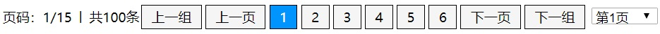
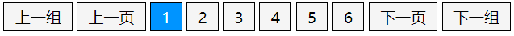

# JZPagination

#### 介绍
一个简单实用的页码条JS生成插件

+ 可以展示 完整模式 和 简单模式



#### 安装教程

1. 在需要页码条的html页面 导入 JZPagination.js文件
2.  在页面上准备一个容器
   + 组件 生成  的是 文本 和 a 标签
   + 需要自己设置 样式表

#### 使用说明

+ 简单模式：最后一个参数 设置为 true



```js
<body>
  <script src="./JZPagination.js"></script>

  <!-- 1.页码条 容器标签 -->
  <div id='pageBar'></div>

  <script>
    // 2.页面加载完毕后 调用组件 页码条方法
    window.onload = function () {
      // 参数：翻页方法 , 页码条容器dom或id ，当前页码 ，页容量 ，页码组容量 ，总行数，是否简单模式
      makePageBar(toPage, 'pageBar', 1, 5, 8, 1000,true);
    }

    /**
     * @description: 3. 翻页方法
     * @param {string}  pageIndex - 要前往的页码
     */
    function toPage(pageIndex) {
      makePageBar(toPage, 'pageBar', pageIndex, 5, 8, 1000,true);
    }
  </script>
</body>
```

+ 完整模式：最后一个参数 设置为 false，或删掉


```js
<body>
  <script src="./JZPagination.js"></script>

  <!-- 1.页码条 容器标签 -->
  <div id='pageBar'></div>

  <script>
    // 2.页面加载完毕后 调用组件 页码条方法
    window.onload = function () {
      // 参数：翻页方法 , 页码条容器dom或id ，当前页码 ，页容量 ，页码组容量 ，总行数，是否简单模式
      makePageBar(toPage, 'pageBar', 1, 5, 8, 1000);
    }

    /**
     * @description: 3. 翻页方法
     * @param {string}  pageIndex - 要前往的页码
     */
    function toPage(pageIndex) {
      makePageBar(toPage, 'pageBar', pageIndex, 5, 8, 1000);
    }
  </script>
</body>
```

